# Объяснение физики и физических формул

В данном разделе мы объсняем базовые вещи в физике. Также тут подробно рассказывается о формула, которые используются в проекте. Представляем вам описание и картинки к каждой формуле.

### [Оглавление](index.md)

## 7 основных единиц СИ
- Килограмм
- Метр
- Секунда
- Ампер
- Кельвин
- Моль
- Кандела

## Расшифровка сокращений физических величин

- Н - Ньютоны
- кг - Килограммы
- кг/м^2 - Плотность вещества
- м/с^2 - Ускорение
- м/с - Скорость
- Кл - Электрический заряд
- ф - Емкость конденсатора
- Гн - Индуктивность
- рад/с - Угловая частота
- Гц - Частота
- с - Секунда
- Н/м или кг/с^2 - Жесткость пружины
- Дж*с - Постоянная Планка
- кг*м/с - Импульс
- Дж/кг - Удельная теплота сгорания топлива 
- л - Литры, Объем
- моль/л - Молярная концентрация
- Ом - сопротивление проводника
- Ом*м - удельное сопротивление проводника
- м^2 - Площадь

## Константы

- g = 9.81 м/с^2

## Знаки операторов

- (+) Сложение
- (-) Минус
- (*) Умножение
- (/) Деление
- (^) Возведение в степень
- (sqrt) Извлечени корня

## Большие величины
- дека (да) = 10^1
- гекто (г) = 10^2
- кило (к) = 10^3
- мега (М) = 10^6
- гига (Г) = 10^9
- тера (Т) = 10^12
- пета (П) = 10^15
## Малые величины
- деци (д) = 10^-1
- сатни (с) = 10^-2
- милли (м) = 10^-3
- микро (мк) = 10^-6
- нано (н) = 10^-9
- пико (п) = 10^-12
- фемто (ф) = 10^-15

## Второй закон Ньютона
Второй закон Ньютона — дифференциальный закон механического движения, описывающий зависимость ускорения тела от равнодействующей всех приложенных к телу сил и массы тела. Один из трёх законов Ньютона. Основной закон динамики. 
- F = m*a 
  - F - сумма всех сил приложенных к телу, [Н]. 
  - m - масса тела, [кг]. 
  - a – ускорение тела, [м/с^2].
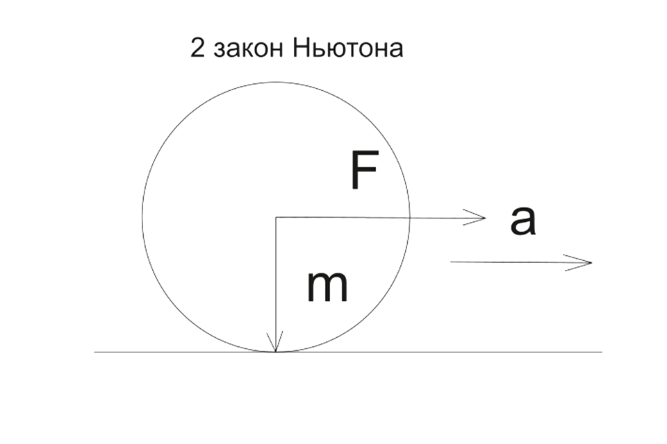
## Закон Архимеда
Закон Архимеда — закон гидростатики и аэростатики: на тело, погружённое в жидкость или газ, действует выталкивающая сила, численно равная весу объема жидкости или газа, вытесненного телом.            
- F = ρ*g*V 
  - F – сила Архимеда, [Н]. 
  - ρ - плотность жидкости или газа, [кг/м^2].
  - g – ускорение свободного падения, [м/с^2].
  - V - объем части тела, погруженной в жидкость или газ, [м^3]. 
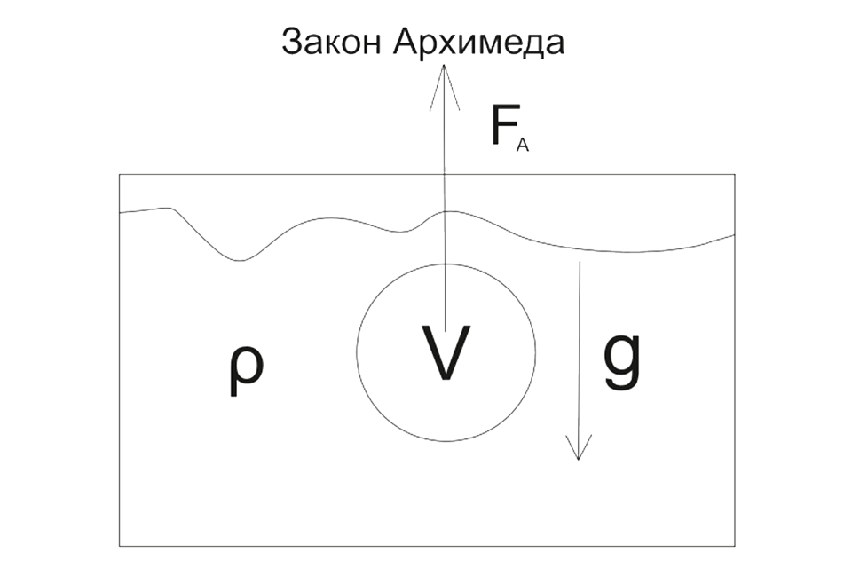
## Максимум и минимум интерференции
### Максимум интерференции
Разность хода волн равна целому числу длин волн (иначе чётному числу длин полуволн) При сложении колебаний с равной частотой происходит обнуление.
- λ = d/k;
  - k - порядок спектра.
  - λ - лямбда.
  - d - разность хода.
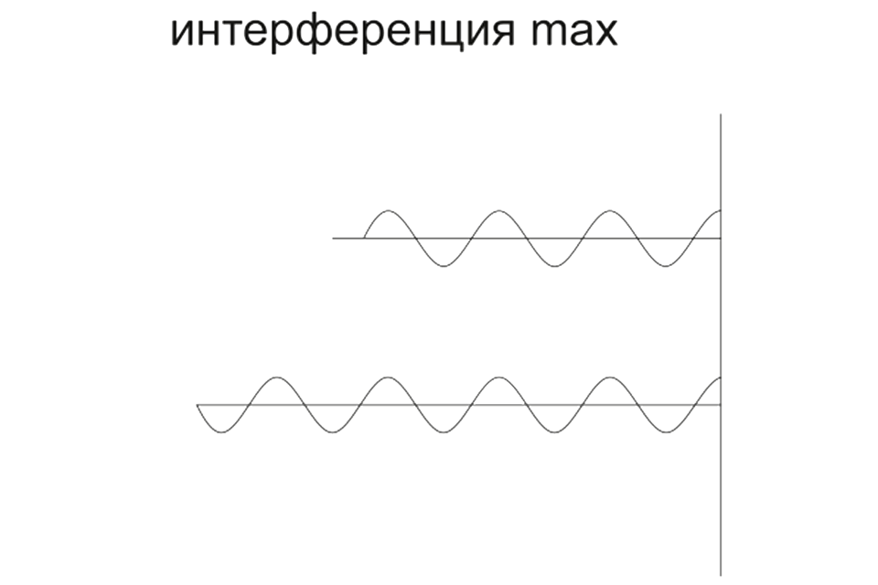
### Минимум интерференции
Если разность хода волн равна нечетному числу полуволн, то в точке наложения этих волн образуется интерференционный минимум. При сложении колебаний с разной частотой происходит обнуление.
- k = ((d/(λ/2))-1)/2;
  - k - порядок спектра.
  - λ - лямбда.
  - d - разность хода.
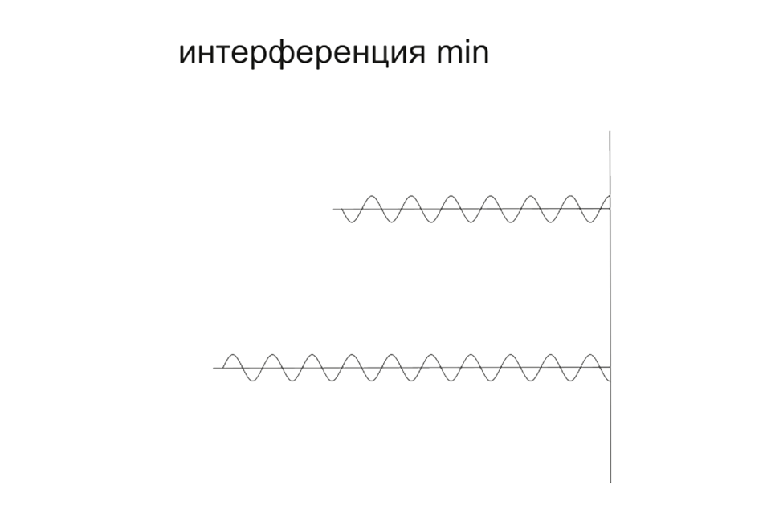
## Закон Ома
Сила тока в проводнике прямо пропорциональна напряжению на концах проводника          
- R = U/I
  - R - сопротивление [Ом].
  - U - напряжение [В].
  - I – сила тока [А].
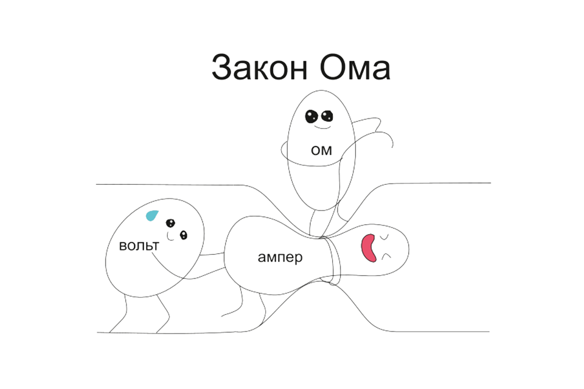
## Сила Ампера
Это сила, с которой магнитное поле действует на помещенный в него проводник с током.            
- F = B*I*L*sin ⁡a
  - B – магнитное поле [Тл].
  - I – сила тока [А].
  - L – длина проводника [м].
  - sin a – угол падения на магнитное поле.
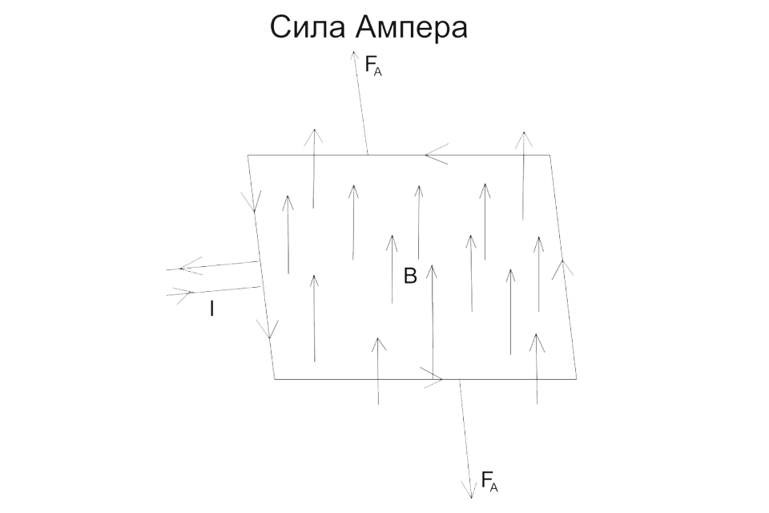
## Относительность массы
Увеличение массы при увеличении скорости относительно массы тела в покое.               
- E = m*c^2
  - E - энергия [Дж].
  - m - масса [кг].
  - c - скорость света [м/с].
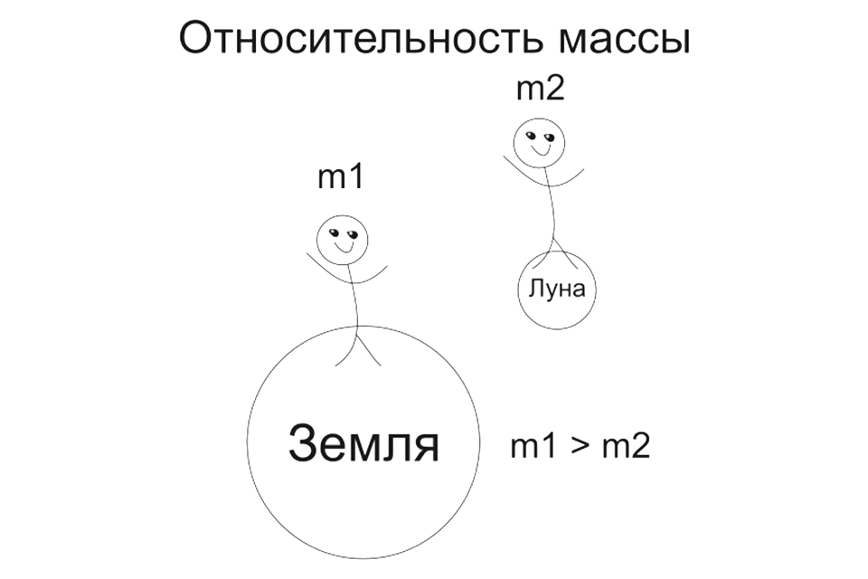
## Кинетическая энергия
Физическая величина, характеризующая состояние тела или системы тел по их движению               
- E = m*V^2/2 
  - E – кинетическая энергия [Дж].
  - m – масса тела [кг].
  - V – скорость тела [м/с].
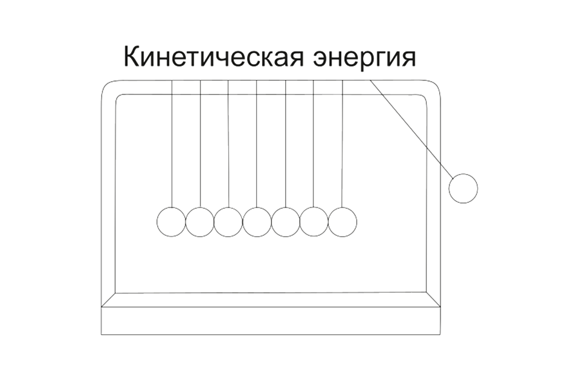
## Сила Кулона
Величина электрической силы между двумя точечными зарядами в вакууме прямо пропорциональна произведению модулей зарядов и обратно пропорциональна квадрату расстояния между ними.
- F = k*(q1*q2)/r^2 
  - F – сила Кулона [Н].
  - k -  коэффициент пропорциональности.
  - q1, q2 - взаимодействующие тела [Кл].
  - r - расстояние между телами [м].
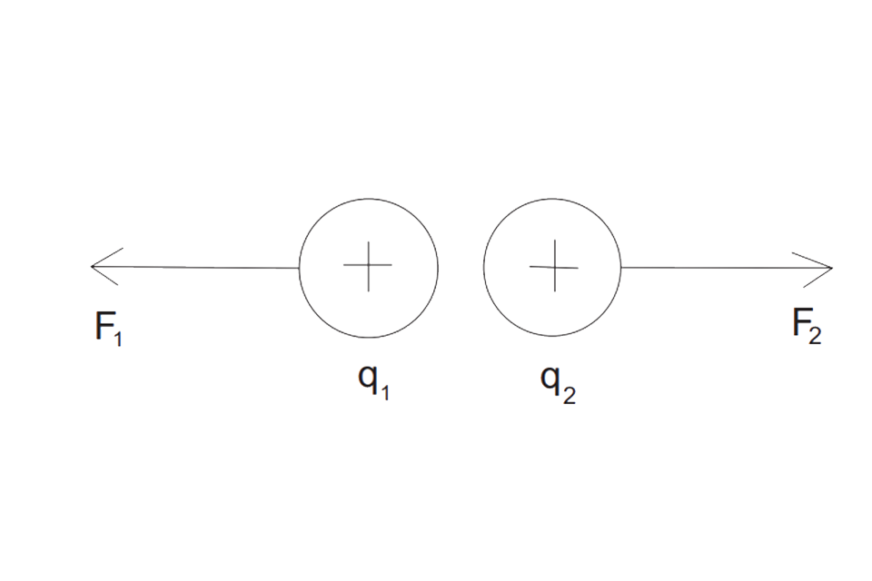
## Сила Лоренца
Сила, с которой магнитное поле действует на заряженную частицу, движущуюся в этом поле          
- F = q*(E + V*B)
  - F - сила Лоренца [Н].
  - q - заряд частицы [Кл].
  - E - напряженность электрического поля [Н/Кл].
  - V - скорость частицы [м/с].
  - B - магнитная индукция [Тл].
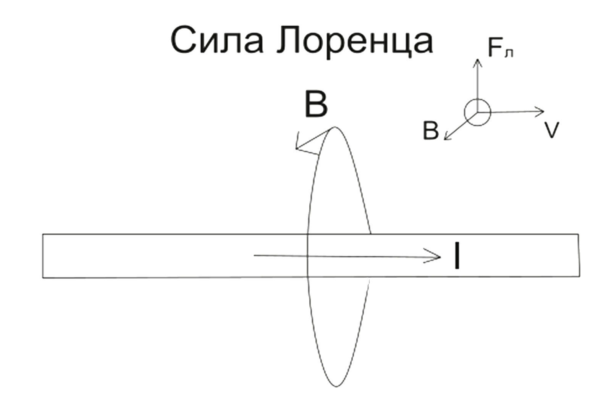
## Частота колебаний
Частота колебаний — число полных колебаний тела за одну секунду               
- v =  1/T 
  - v – частота колебаний [Гц].
  - T – период колебаний [с].
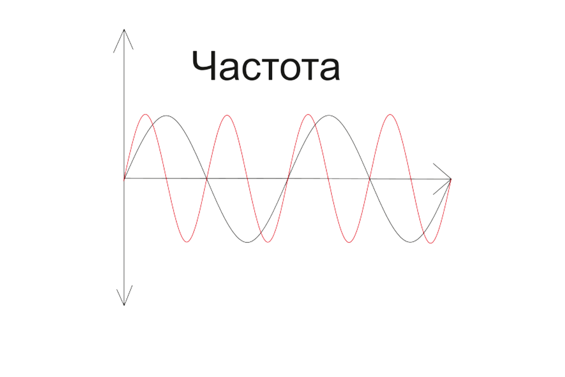
## Закон Томсана
Закон Томсона — математическое выражение связывающее собственную частоту, индуктивность и ёмкость электрических или электромагнитных колебаний в электрическом колебательном контуре
- T = 1/f = 2*π*sqrt(L*C) = 2*π/w = 2π/(1/sqrt(L*C)) = 2π*sqrt(L*C)
  - T - период свободных колебаний в колебательном контуре [с].
  - f - частота собственных колебаний [Гц].
  - w - угловая частота собственных колебаний [рад/с].
  - L – индуктивность [Гн].
  - С – ёмкость [ф].
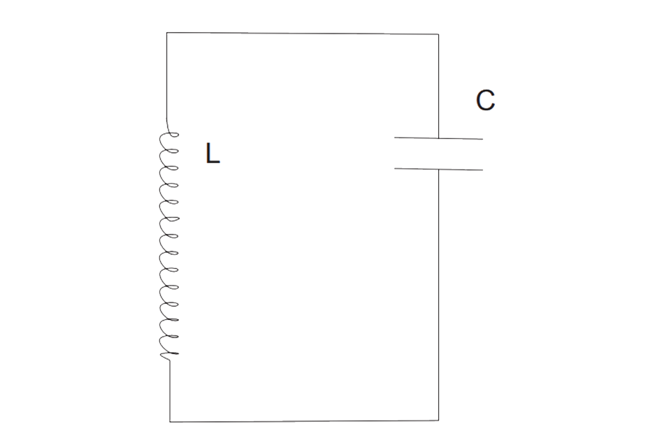
## Период колебания пружинного маятника
Период колебания пружинного маятника – зависит от жесткости пружины: с увеличением коэффициента жесткости пружины период колебания маятника уменьшается  
- T = 2*π*sqrt(m/k)
  - T – период колебания пружинного маятника [с].
  - m – масса груза [кг].
  - k – жесткость пружины [Н/м].
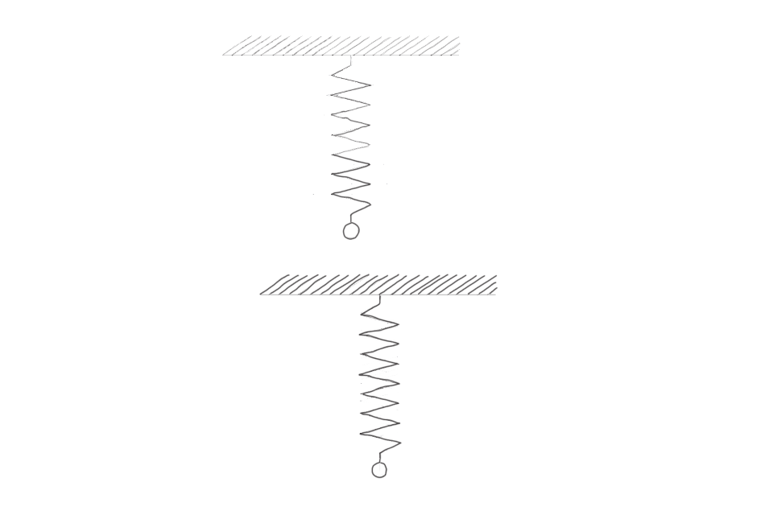
## Путь при свободном падении тела
Путь, пройденный телом при свободном падении, можно рассчитать по формуле:
- h = (g*t^2)/2
  - h - путь падения [м].
  - t - время падения [с].
  - g - ускорение свободного падения [м/с^2].
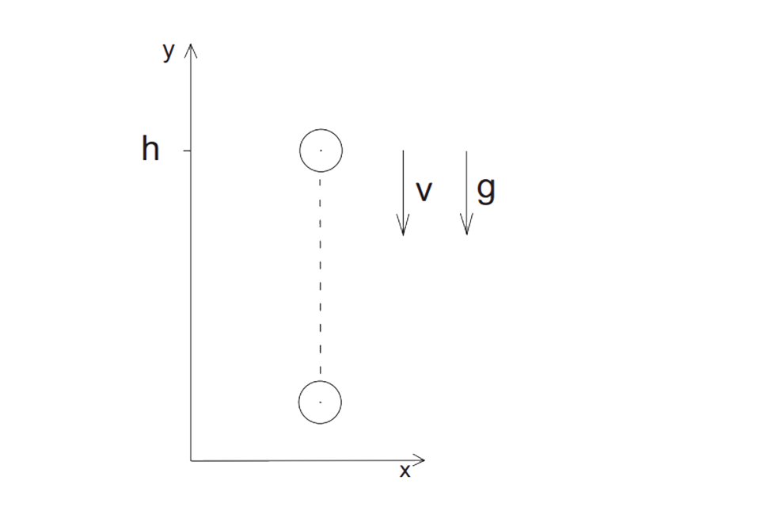
## Скорость свободного падения
Свободным падение будем называть движение предметов вертикально вниз или вертикально вверх. Это равноускоренное движение, но особый его вид. Для этого движения справедливы все формулы и законы равноускоренного движения.
- V = g*t
  - V - скорость [м/с].
  - g - ускорение свободного падения [м/с^2].
  - t - время свободного падения [с].

## Период полураспада
Время в течении которого количество частиц  и интенсивность реакции распада уменьшаются в двое
- N = N0*(1/2)^t/T
  - N - количество ядер в искомый момент времени
  - N0 - количество ядер в начальный момент времени
  - t - время прошедшее с начала распада [с]
  - T - период полураспада [с]
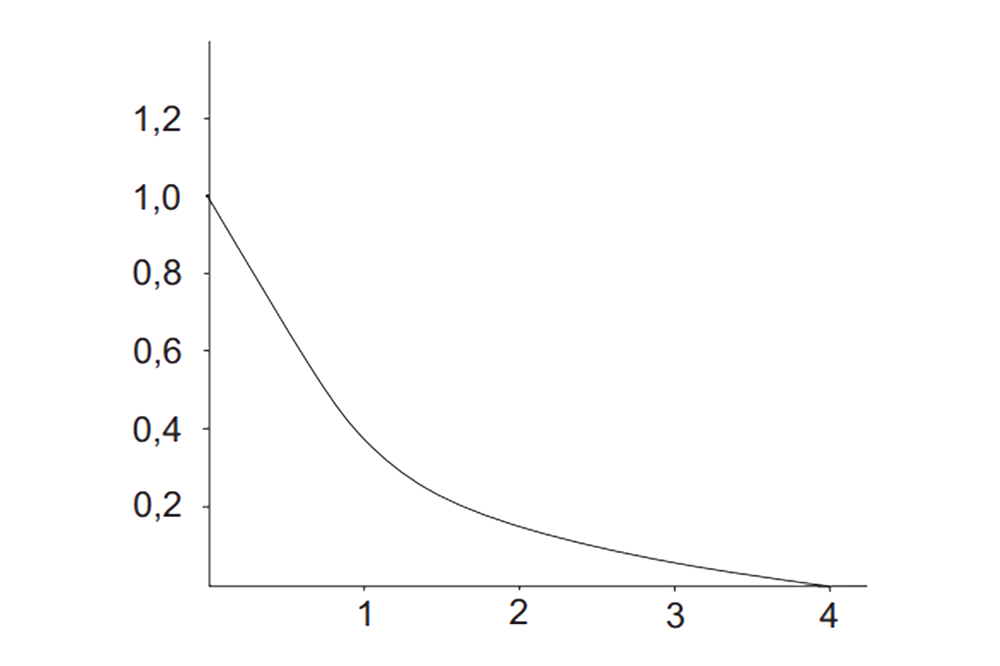
## Длина волны
Длина волны, которая проявляется у всех частиц в квантовой механике согласно корпускулярно-волновому дуализму, и определяющая плотность вероятности обнаружения объекта в заданной точке конфигурационного пространства. Длина волны де Бройля обратно пропорциональна импульсу частицы
- λ = h/p
  -  λ – длина волны [м]
  -  h - постоянная планка [Дж*с]
  -  p – конечный импульс [кг*м/с]
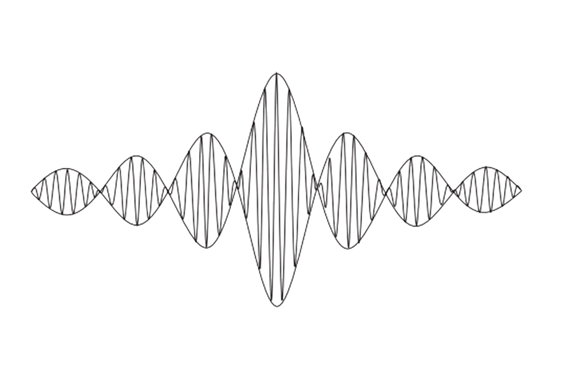
## Скорость
Отношениее растояние, пройденного тола и времени, затраченого на путь
- V = S/t
  - V - скорость [м/с]
  - S - растояние [м]
  - t - время [с]
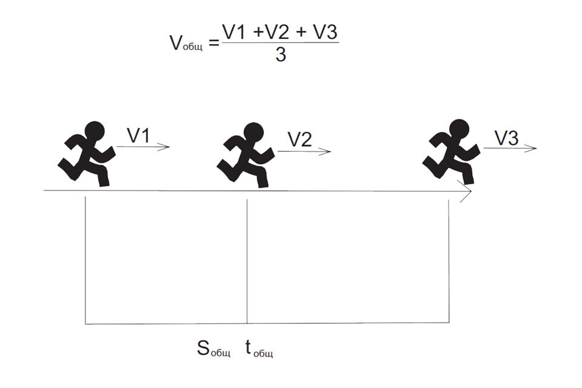
## Абсолютная температура
Это температура измеряемая в Кельвинах
- t = tc + 273
  - t - температура в Кельвинах
  - tc - температура в Цельсиях
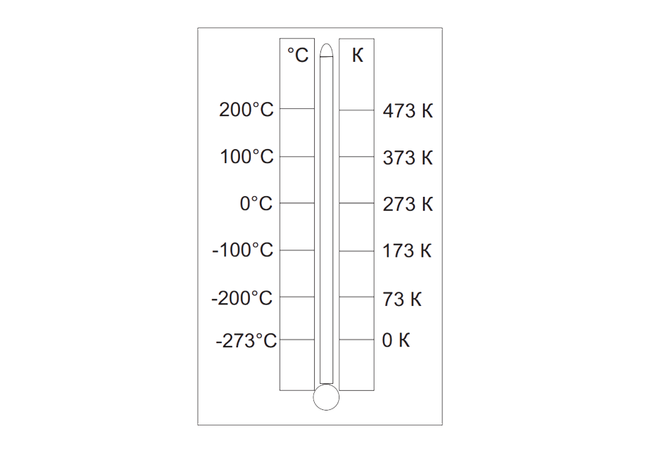
## Количество вещества
Кол-во однотипных структурных едениц содержащихся в веществе 
- n = m/M
  - n - количество вещества [моль]
  - m - масса веществ [г]
  - M - молярная масса  [г/моль]
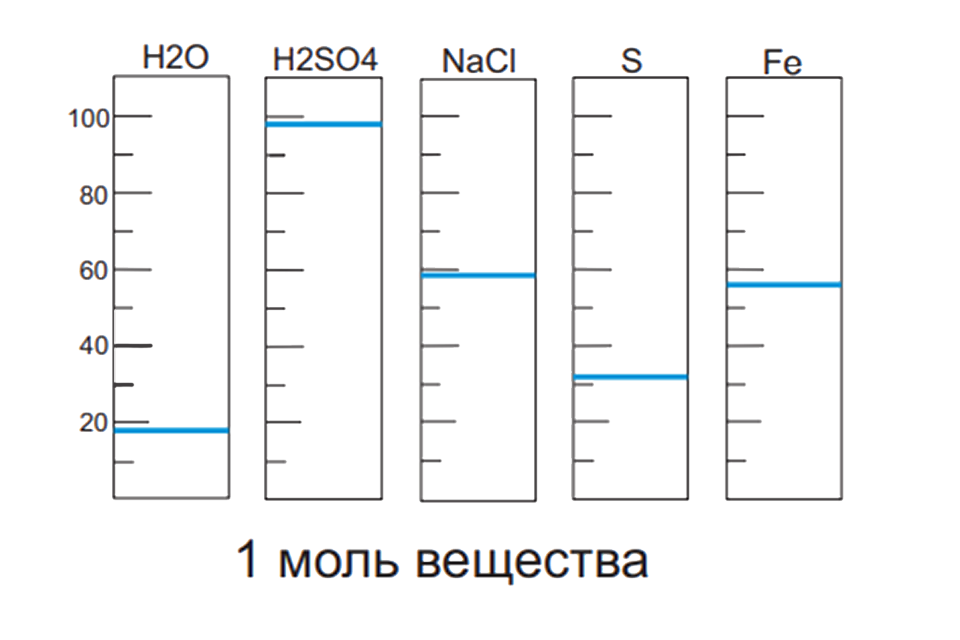
## Концентрация молекул
Величина, количественно характеризующая содержание компонента относительно всей смеси.                     
- Cм = m/(M*V)
  - Cм – молярная концентрация [моль/л]
  - m – масса растворенного в растворе вещества [г]
  - M – молярная масса растворенного вещества  [г/моль]
  - V – объем рествора [л]
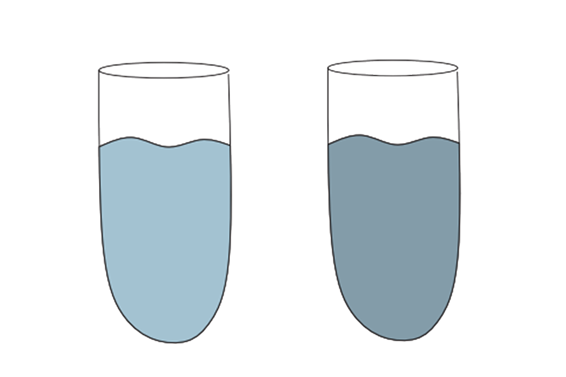
## Скорость распространения волны
Расстояние, на которое распространяется волна в еденицу времени 
- V = λ/T
  - V - скорость ее распространения  [м/с]
  - λ - длина волны [м]
  - T - период колебаний [с]
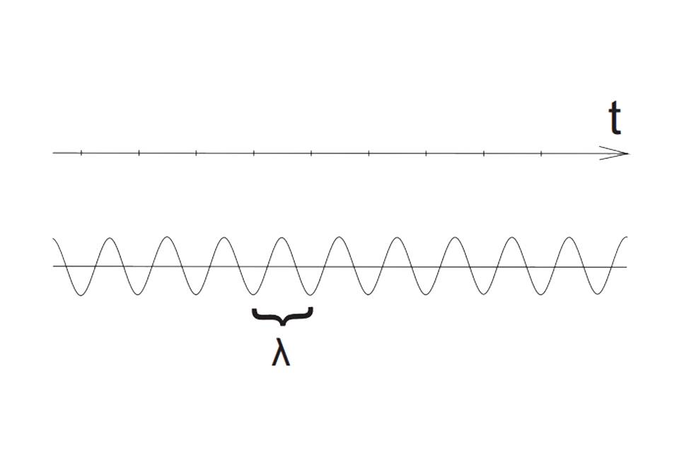
## Координата в момент времени t
- h = (g*t^2)/2
  - h - координата [м]
  - g - ускорение свободного падения [м/с^2].
  - t - время [с]
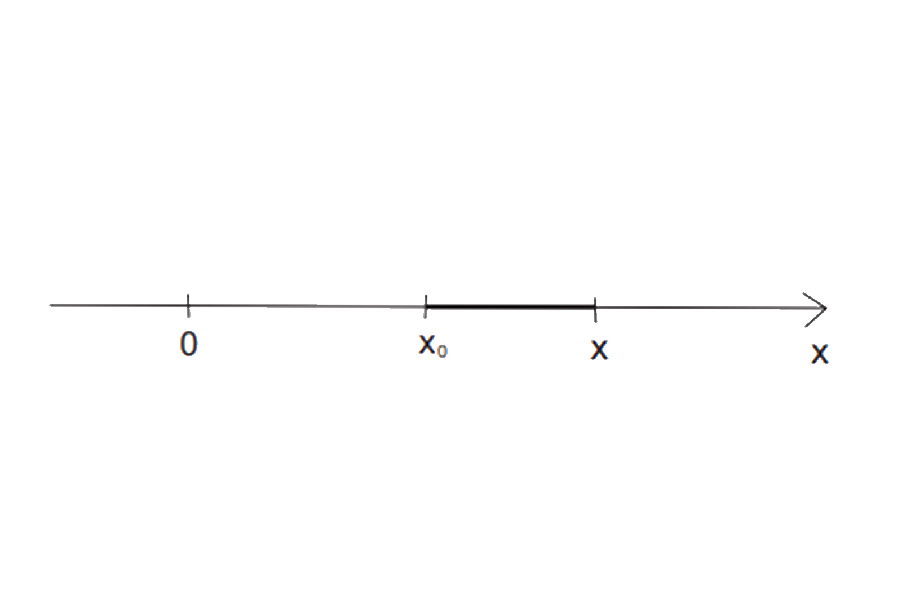
## Растояние полета по горизонтали
- S = U*t
  - S - расстояние полета [м].
  - U - скорость полета [м/с].
  - t - время полета [с].
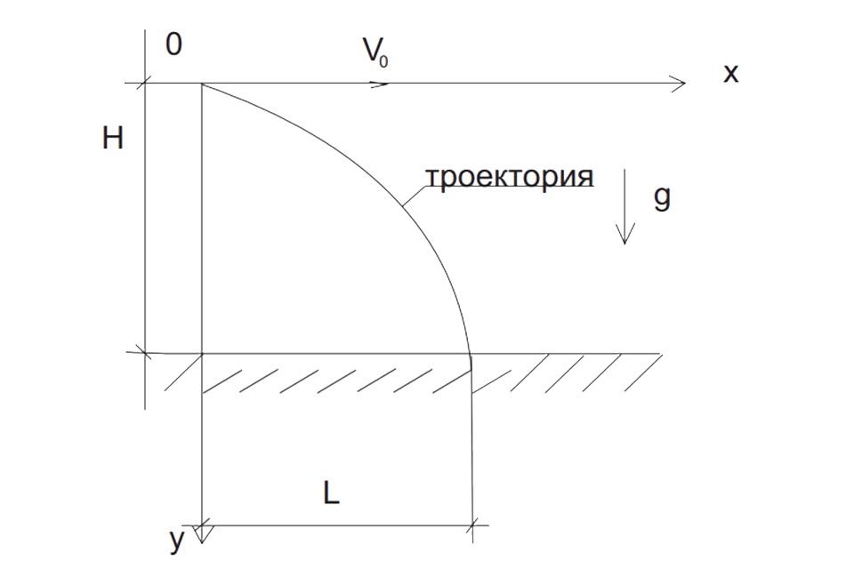
## Потенциальная энергия
Потенциальная энергия — скалярная физическая величина, представляющая собой часть полной механической энергии системы, находящейся в поле консервативных сил.
- E = m*g*h
  - E - потенциальная энергия [Дж].
  - m - масса тела [м].
  - g - ускорение свободного падения [м/с^2].
  - h - высота, на которой находится тело [м]
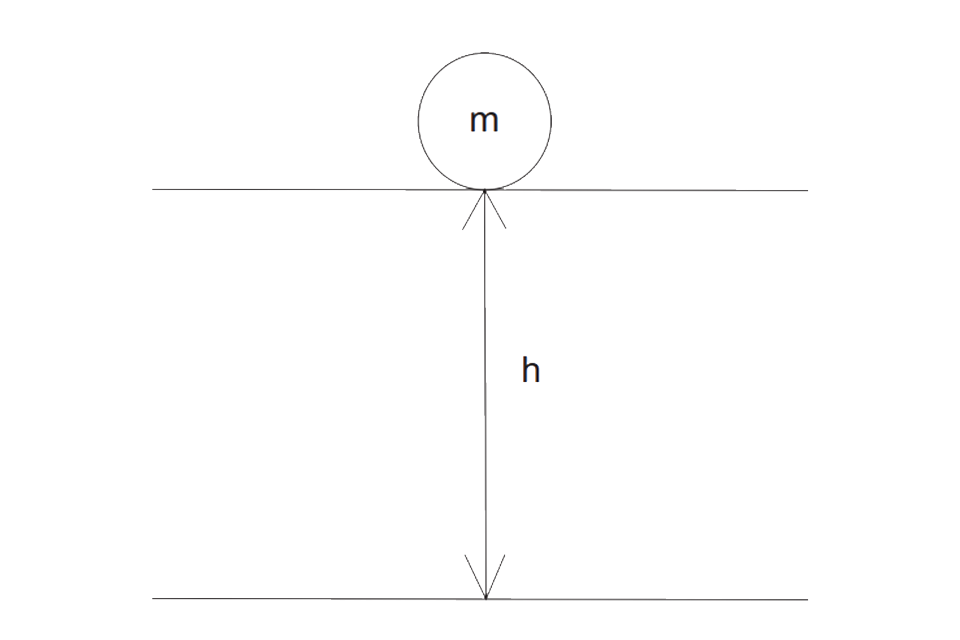
## Сила тяжести
Сила тяжести — сила, действующая на любое физическое тело вблизи поверхности астрономического объекта (планеты, звезды) и складывающаяся из силы гравитационного притяжения этого объекта
- F = m*g
  - F - сила тяжести [Н].
  - m - масса тела [кг].
  - g - ускорение свободного падения [м/с^2].
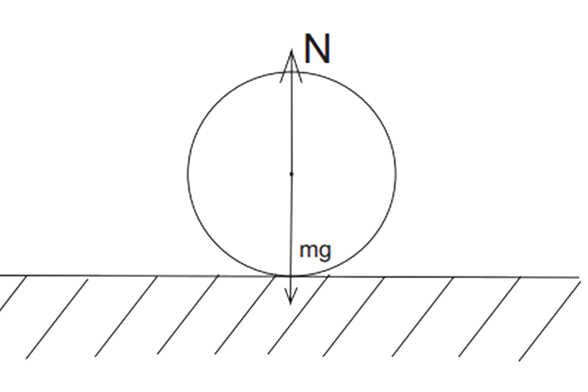
## Количество передоваемой теплоты
Удельная теплоёмкость — это отношение теплоёмкости к массе, теплоёмкость единичной массы вещества; физическая величина, численно равная количеству теплоты, которое необходимо передать единичной массе данного вещества для того, чтобы его температура изменилась на единицу
- Q = c*m*(t2-t1)
 - Q - количество теплоты [Дж].
 - c - удельная теплоемкость [Дж/(кг*°C)].
 - t1 - начальная температура.
 - t2 - конечная температура.

## Плавление тела
Теплота плавления — количество теплоты, которое необходимо сообщить одной единице массы кристаллического вещества, чтобы перевести его из твёрдого состояния в жидкое.
- Q = λ*m
  - Q - количество теплоты [Дж].
  - λ - удельная теплота плавления [кДж/кг].
  - m - масса вещества [кг].

## Теплота парообразования
Теплота парообразования — количество теплоты, которое необходимо сообщить веществу при постоянных давлении и температуре, чтобы перевести его из жидкого состояния в газообразное.
- Q = L*m
  - Q - количество теплоты [Дж].
  - L - удельная теплота парообразования [Дж/кг].
  - m - масса вещества [кг].
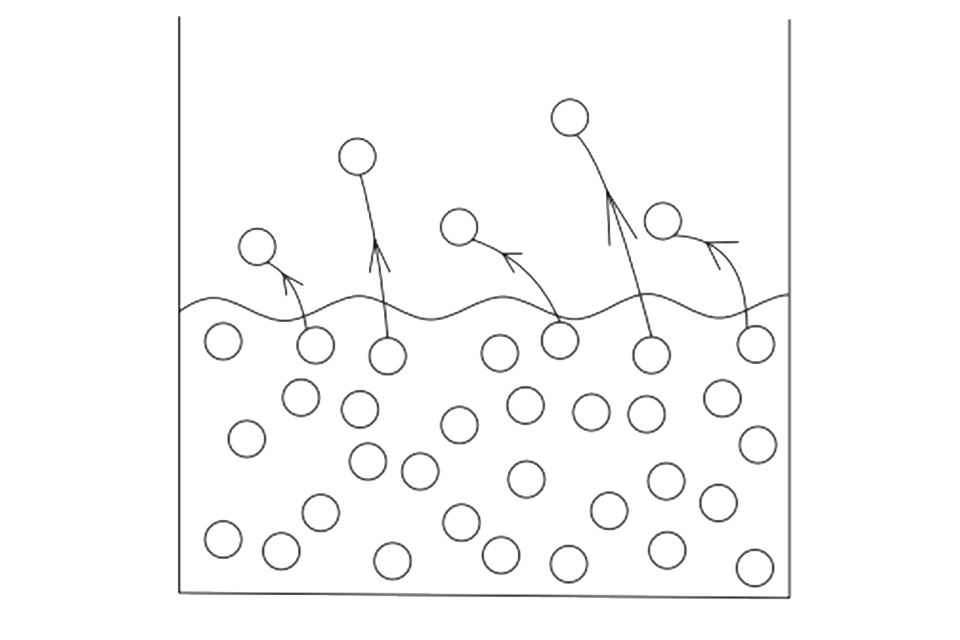
## Горение топлива
Физико-химический процесс перехлда из исходного  вещества в продукты сгорания сопровождающийся интенивным выделением тепла
- Q = q*m
  - Q - количество теплоты [Дж].
  - q - удельная теплота сгорания [Дж/кг].
  - m - масса вещества  [кг].
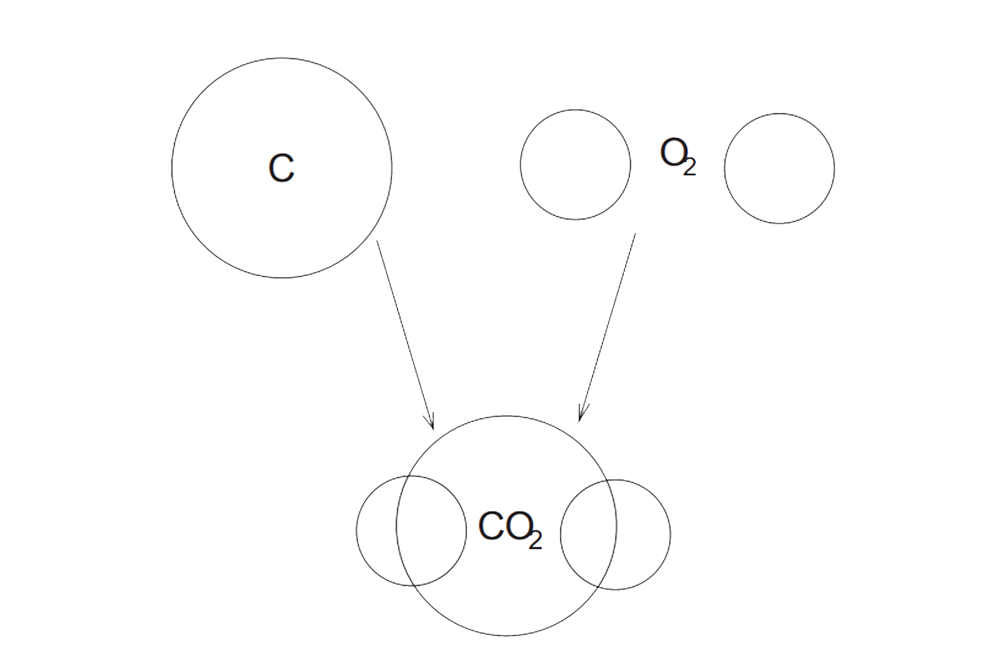
## Удельное сопротивление проводника
- R = (p*l)/S
  - R - сопротивление проводника [Ом].
  - p - удельное сопротивление проводника [Ом*м].
  - l - длина проводника [м].
  - S - площадь сечения проводника [м^2].
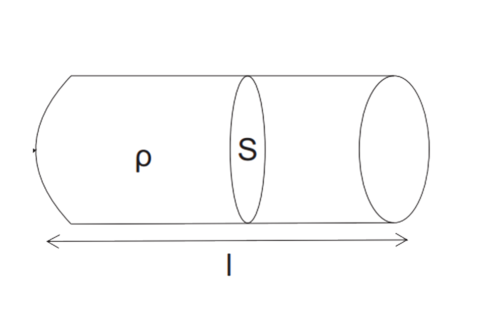